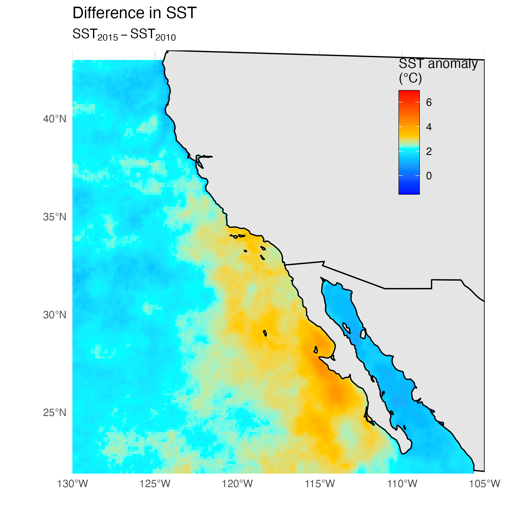
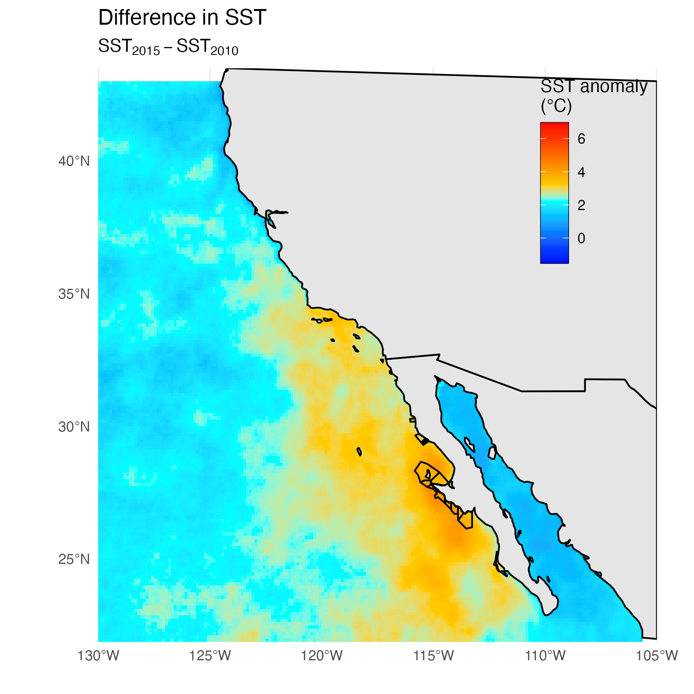
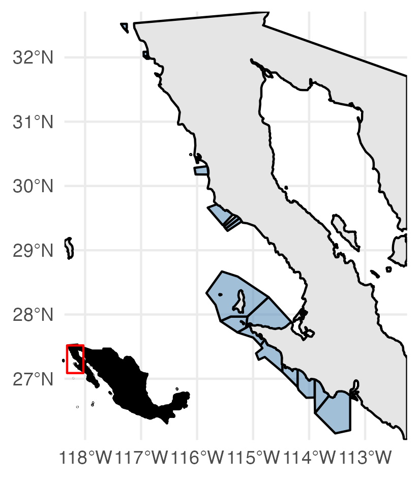
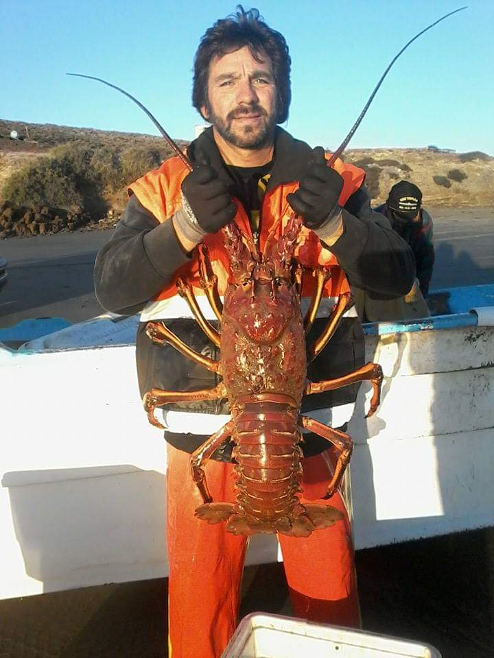
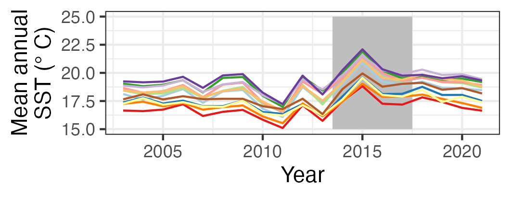
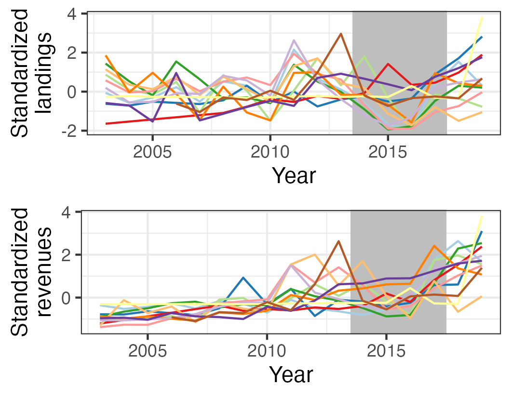
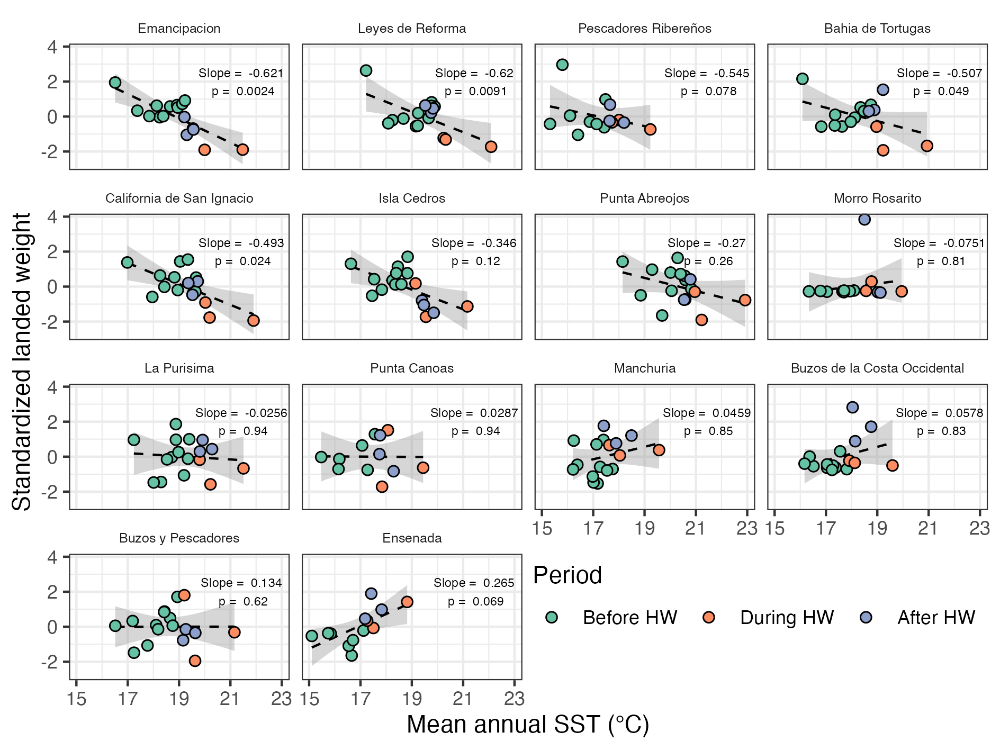
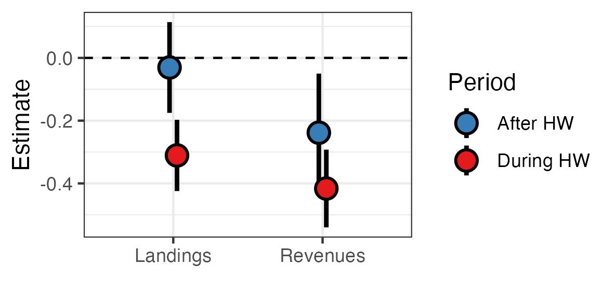

```{css slide-number-off, echo = F}
.remark-slide-number {
  display: none;
}
```

```{r, echo = F, include = F, warnings = F}
knitr::opts_chunk$set(echo = F,
                      warnings = F,
                      message = F)
library(xaringanthemer)
style_mono_accent(
  base_color = "#1c5253",
  header_font_google = google_font("Josefin Sans"),
  text_font_google   = google_font("Roboto", "400", "300i", "300b"),
  code_font_google   = google_font("Fira Mono"),
  header_h1_font_size = "2.2rem",
  header_h2_font_size = "2rem",
  text_font_size = "1.1rem",
  link_color = "#808080",
  header_background_auto = T,
  footnote_font_size = "0.75rem"
)
```

```{bash, echo = F}
cp ../results/img/* ./img
```


# Warming up

.pull-left[
- Warm water during 2014 - 2017


- Well-documented impacts on ecological communities


]

.pull-right[

]

---
# Warming up

.pull-left[
- Warm water during 2014 - 2017


- Well-documented impacts on ecological communities


- Largest anomalies around Baja


]

.pull-right[

]

---
class: inverse,center,middle

# What were the economic impacts?

---
# The focus

.pull-left[
### 14 TURFs in Baja

]

--

.pull-right[
### Spiny lobster fishery


_Panulirus interruptus_
]


---
# SST, landings, and revenues across TURFs

.pull-left[]


---
# SST, landings, and revenues across TURFS

.pull-left[



]

--

.pull-right[]


---
# Estimated impacts

.pull-left[
##Log-linear fixed-effects panel regressions



]

.pull-right[
## During

- 26% decrease in landings

- 34% decrease in revenues
]

---
# Estimated impacts

.pull-left[
##Log-linear fixed-effects panel regressions


]

.pull-right[
## During

- 26% decrease in landings

- 34% decrease in revenues


## After

- 3% decrease in landings

- 21% decrease in revenues

]

---
background-image: url(img/ero_lobster.jpg)
background-position: center;
background-repeat: no-repeat;
background-size: contain;
class:inverse,center,middle
# The end

---
# Extra

|           | log(Landings) | log(Revenues) | log(Landings)  | log(Revenues)  |
|:----------|:-------------:|:-------------:|:--------------:|:--------------:|
|During HW  |    -0.311*    |   -0.416**    |     0.733*     |    0.660**     |
|           |    (0.114)    |    (0.124)    |    (0.083)     |    (0.082)     |
|Aeftr HW   |    -0.031     |    -0.238     |     0.970      |     0.788      |
|           |    (0.145)    |    (0.188)    |    (0.140)     |    (0.148)     |
|Time trend |    0.027+     |   0.144***    |     1.027+     |    1.155***    |
|           |    (0.013)    |    (0.026)    |    (0.013)     |    (0.030)     |
|Num.Obs.   |      225      |      225      |      225       |      225       |
|RMSE       |     0.50      |     0.62      |      0.50      |      0.62      |
|Std.Errors |   by: coop    |   by: coop    |    by: coop    |    by: coop    |
|FE: coop   |       X       |       X       |       X        |       X        |

__Note:__
^^ + p < 0.1, * p < 0.05, ** p < 0.01, *** p < 0.001


